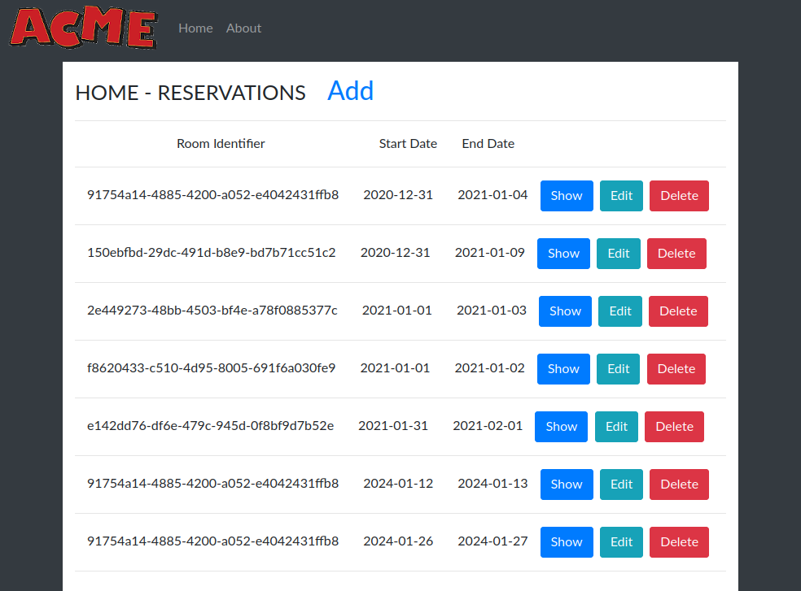
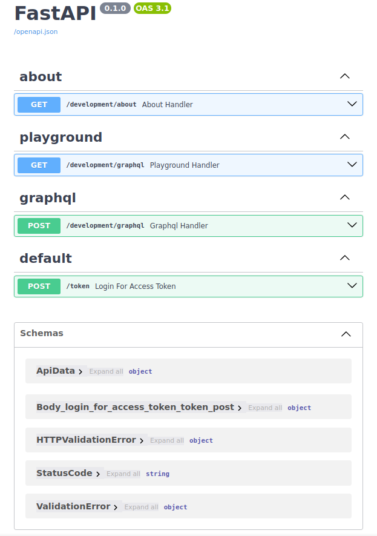
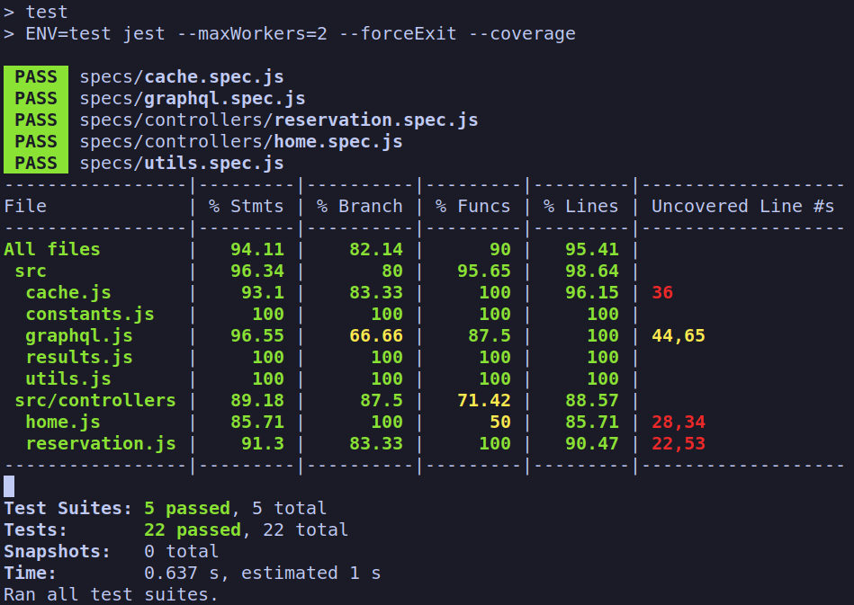
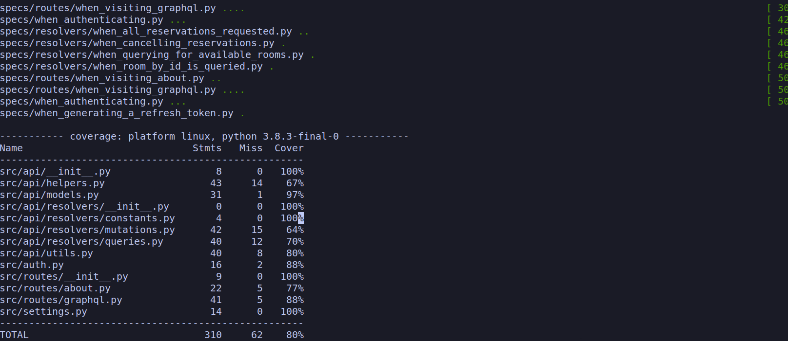

# Hotel Reservation MVC Example - JavaScript/Python

**JavaScript, Expressjs, MVC frontend, Memcached, Python, FastAPI, GraphQL, AsyncPG, Postgres**
[](https://github.com/WillSams/example-mvc-expressjs-with-python/actions/workflows/pr-validate.yml)

This example contains a frontend and backend:

- The frontend is an [Express](https://expressjs.com/) application using an MVC architecture and [Pug](https://pugjs.org/api/getting-started.html) + [Bootstrap4](https://getbootstrap.com/docs/4.6/getting-started/introduction/) for view templating.
- The backend is a [GraphQL API](https://graphql.org) providing the ability to create, delete, and list reservatios plus available rooms for a given date range.

React [Javascript](https://github.com/WillSams/example-js-react-with-python) and  [Typescript](https://github.com/WillSams/example-ts-react-with-python) versions of this same idea are available.

Booked reservations are listed via the API. Each reservation request were processed in the order provided as if they were real-time requests. The following rules are observed:

**Context**:

* When a room is reserved, it cannot be reserved by another guest on overlapping dates.
* Whenever there are multiple available rooms for a request, the room with the lower final price is assigned.
* Whenever a request is made for a single room, a double bed room may be assigned (if no single is available?).
* Smokers are not placed in non-smoking rooms.
* Non-smokers are not placed in allowed smoking rooms.
* Final price for reservations are determined by daily price * num of days requested, plus the cleaning fee.

**Web UI Usage**:

 

**API Usage**:

Example usage via [curl](https://curl.se/download.html):

```bash
# First, grab an access token provided by the API
ACCESS_TOKEN=$(curl -s -X POST \
  -H 'accept: application/json' \
  -H 'Content-Type: application/x-www-form-urlencoded' \
  -d 'grant_type=password&username=example-user&password=example-user' \
  'http://localhost:8080/token' | jq -r '.access_token')

# List all existing booked reservations
curl http://localhost:$API_PORT/development/graphql \
    -H 'Content-Type: application/json' \
    -H "Authorization: Bearer ${ACCESS_TOKEN}" \
    -d '{"query": "query { getAllReservations { reservations { room_id checkin_date checkout_date  } } }"}'

# Create a new reservation
# Note: if there is an overlap, you'll see a 
#   'Reservation dates overlap with an existing reservation' error message
# To see the aforementioned error, run this mutation a multiple times
curl http://localhost:$API_PORT/development/graphql \
    -H 'Content-Type: application/json' \
    -H "Authorization: Bearer ${ACCESS_TOKEN}" \
    -d '{ "query": "mutation { createReservation( input: { room_id: \"91754a14-4885-4200-a052-e4042431ffb8\", checkin_date: \"2023-12-31\", checkout_date: \"2024-01-02\"  }) { success errors reservation { id room_id checkin_date checkout_date total_charge } } }" }'

# List Available Rooms for a given date range
curl http://localhost:$API_PORT/development/graphql \
    -H 'Content-Type: application/json' \
    -H "Authorization: Bearer ${ACCESS_TOKEN}" \
    -d '{"query": "query { getAvailableRooms( input: { checkin_date: \"2023-12-31\", checkout_date: \"2024-01-02\" }) { success errors rooms { id num_beds allow_smoking daily_rate cleaning_fee } } }" }'
```

**Open API UI Usage**:

Navigate to [http://localhost:$API_PORT/docs](http://localhost:$API_PORT/docs).



**Table of Contents**:

* [Prerequisites](#prerequisites)
* [Getting Started](#getting-started)
    - [Install Python Packages](#install-python-packages)
    - [Install Node.js Packages](#install-nodejs-packages)
    - [Create the Database](#create-the-database)
* [Development](#development)
* [Testing](#testing)
* [TODO](#todo)
* [License](#license)

## Prerequisites

To run the service, you will need to install the following tools.

* [Python](https://www.python.org/downloads/)
* [NodeJS](https://nodejs.org/en/)
* [Docker](https://www.docker.com/)

The below are optional but highly recommended:

* [nvm](https://github.com/nvm-sh/nvm) - Used to manage NodeJS versions.
* [Direnv](https://direnv.net/) - Used to manage environment variables.

## Getting Started

First, we'll need to set up our environment variables.  You can do this by either any of the methods mentioned in [/tools/ENV.md](./tools/ENV.md) but I recommend using [Direnv](https://direnv.net/).

### Install Python Packages

Next, execute the following in your terminal:

```bash
python -m venv venv
source venv/bin/activate
pip install --upgrade pip 
pip install -r requirements.txt
```

### Install Node.js Packages

Execute the following within your terminal:

```bash
nvm use             # To eliminate any issues, install/use the version listed in .nvmrc. 
npm i               # install the packages needed for project 
```

### Create the database

Finally, let's create and seed the database and our Reservations and Rooms tables:

```bash
# Create the database and seed it
NODE_ENV=development | npm run refresh && npm run seed
```

During development, you can just execute `npm run dev:db-baseline` to refresh the database back to the original seed data.

## Development

To run both the frontend and backend concurrently:

```bash
docker-compose up -d  # runs the database in the background
npm run dev
```

Also, you just execute the backend via `npm run dev:backend`.  to verify the backend is working:

```bash
curl http://localhost:$API_PORT/$ENV/about
```

You can also acces the Ariadne GraphiQL (interactive test playground) instance at [http://localhost:$API_PORT/$ENV/graphql](http://localhost:$PLAYGROUND_PORT/$ENV/graphql).  

## Testing

The frontend utilizes [Jest](https://jestjs.io/).  To run these tests, simply execute `npm run test:frontend`.

 

The backend tests organized for improved readability and comprehension. These tests are segmented into individual files, a structure that simplifies the testing process and enhances accessibility. While individual preferences may vary, this is my chosen approach for managing tests in this project.

To run these tests, simply execute `npm run test:backend`.



## Containerization

### Building the Backend Container

```bash
docker build backend/. -t acme-hotel-example-backend:latest \
    --build-arg RESERVATION_PORT="80" \
    --build-arg ENV="${ENV}" \
    --build-arg IS_DEBUG="${IS_DEBUG}" \
    --build-arg SECRET_KEY="$SECRET_KEY" \
    --build-arg REFRESH_SECRET_KEY="$REFRESH_SECRET_KEY" \
    --build-arg PG_URL="$PG_URL"

# finally, to run a named container
docker run --name backend-dev -p 8000:80 acme-hotel-example-backend`
```

To verify the environment variables set, you can execute the following on the named container by:

```bash
CONTAINER_ID=$(docker ps -qf "name=backend-dev" -n 1)

# this will display the container's environment variables in console
docker exec $CONTAINER_ID printenv   
```

If you need to re-create the container with the same name, do **docker rm <container-name>** (i.e., backend-dev) first.

## License

License information can be found [here](./LICENSE)

